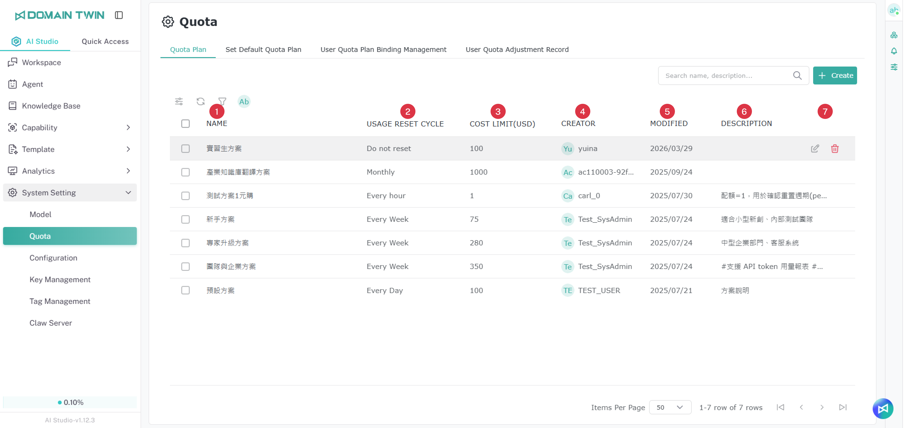

# 配額

## 配額計畫

<figure><figcaption></figcaption></figure>

<table><thead><tr><th width="80">項目</th><th width="170">名稱</th><th>說明</th></tr></thead><tbody><tr><td>1</td><td>名稱</td><td>配額方案的顯示名稱（例如： <code>default</code>, <code>VVIP</code>, <code>Plan VIP</code>）。</td></tr><tr><td>2</td><td>用量重置週期</td><td>配額重置的頻率（例如：每天、每週、每小時）。</td></tr><tr><td>3</td><td>費用限制(USD)</td><td>每個重置週期內允許的最高花費（以美元計算）。<code>-1</code> 代表無限制。</td></tr><tr><td>4</td><td>建立者</td><td>建立此方案的管理員名稱。</td></tr><tr><td>5</td><td>修改日期</td><td>配額方案的修改時間。</td></tr><tr><td>6</td><td>描述</td><td>配額方案用途的內部註解或說明。</td></tr><tr><td>7</td><td>動作</td><td>編輯或刪除此方案的按鈕。</td></tr></tbody></table>

## **新增配額方案**

管理員可透過設定名稱、描述、費用上限與重置週期等參數，建立新的使用配額方案。這些方案會依照此處設定的限制，控制使用者消耗付費資源（例如 API token、模型使用次數）的頻率。

<figure><figcaption></figcaption></figure>

<figure><figcaption></figcaption></figure>

1. 前往 系統設定 > 使用配額限制。
2. 選擇 Quota Plan 分頁。
3. 點擊 加號按鈕 開啟 新增/更新配額方案 表單。
4. Name：方案的顯示名稱。
5. Description：可選的內部備註。
6. Cost Limit (USD)：每個重置週期允許的金額（-1 代表無限制）。
7. Usage Reset Cycle：選擇每天、每週或每小時。
8. 點擊 OK 儲存新配額方案。

## **設定預設配額方案**

**預設配額方案** 定義了所有新建立使用者的基準使用限制，除非另行手動分配特定配額方案。

<figure><figcaption></figcaption></figure>

1. 前往 Set Default Quota Plan 分頁。
2. 點擊 Default User Quota Plan 下拉選單，查看可用方案列表。
3. 從清單中選擇所需方案（例如 `預設`、`VVIP`、`超低配額`）。

> 注意：管理員可先在 Quota Plan 分頁中建立或更新方案，再將其設定為預設。

## **配額方案綁定管理**

**配額方案綁定管理** 功能允許管理員手動為特定使用者分配專屬的使用配額方案，覆蓋預設設定。

<figure><figcaption></figcaption></figure>

<figure><figcaption></figcaption></figure>

1. 前往 系統設定 > 使用者配額計畫綁訂管理。
2. 點擊"創建"建立新綁定。
3. 在左側 (Dataset) 選擇要分配的配額方案（例如 `預設`、`VVIP`、`Plan 1`）。
4. 在右側 (User) 從下拉清單中選擇一位或多位使用者。
5. 點擊 "+" 按鈕手動新增使用者。
6. 點擊 OK 確認分配。

> 注意：一旦分配後，即使之後修改預設方案，該使用者仍會依照已綁定的自訂方案執行。

## **配額調整記錄**

**配額調整記錄** 頁面會記錄所有針對使用者配額使用量的手動變更，特別是來自 **使用者配額計畫綁訂管理** 分頁的操作。

<figure><figcaption></figcaption></figure>

當管理員在 **使用者配額計畫綁訂管理** 分頁，點擊 **重新整理圖示** 時，系統會跳出視窗要求輸入 **重置使用量原因**。此欄位為必填，才能完成重置操作。確認後，更新的預算與原因將顯示在 使用者配額調整紀錄 頁面。

<figure><figcaption></figcaption></figure>

<table><thead><tr><th width="80">項目</th><th width="220">欄位名稱</th><th>說明</th></tr></thead><tbody><tr><td>1</td><td>使用者名稱</td><td>配額被手動調整的使用者名稱。</td></tr><tr><td>2</td><td>處理預算之前 (USD)</td><td>調整前的使用者預算（以美元計算）。</td></tr><tr><td>3</td><td>處理預算之後 (USD)</td><td>調整後的預算（以美元計算）。</td></tr><tr><td>4</td><td>重置用量原因</td><td>用來記錄手動更新或修正的原因。</td></tr><tr><td>5</td><td>建立日期</td><td>執行調整的日期。</td></tr></tbody></table>
